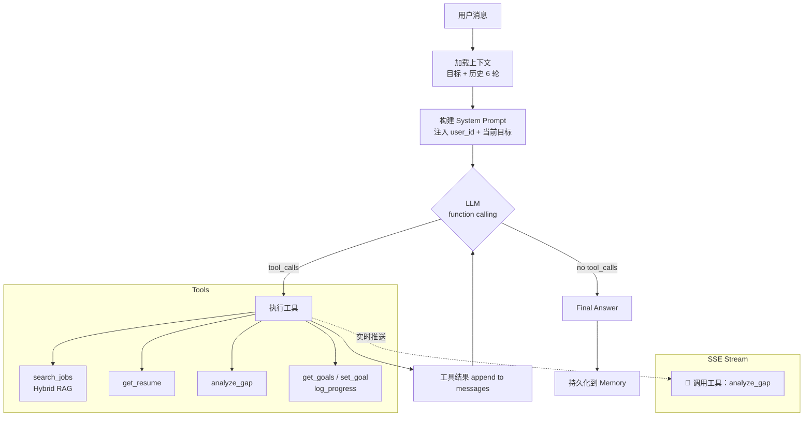

# Careerhub Agent

> 面向 USYD 留学生的求职辅导 Agent —— 基于真正的 LLM function calling ReAct 循环，不是 chatbot，不是固定工具链。

[简体中文](#careerhub-agent) · [Architecture](#architecture) · [Quick Start](#quick-start) · [Tools](#tools) · [Tech Stack](#tech-stack)

---

## What makes this different

大多数「Agent」项目的本质是：**intent classifier → 预定工具链 → LLM 生成回答**。LLM 在 loop 里走的是人预定好的路，从未真正做决策。

这个项目的核心：**LLM 看到所有工具的 schema，自主决定调用哪些、什么顺序、传什么参数。** 这是真正的 ReAct，不是 router。

```
用户: "帮我看看这个 JD 和我简历的差距，顺便推荐几个类似岗位"

Agent 自主决定:
  1. get_resume(user_id)          ← 先拿简历
  2. analyze_gap(user_id, jd)     ← gap 分析
  3. search_jobs(query)           ← 找类似岗位
  → 综合三个工具结果生成回答
```

Intent classifier 根本没法处理这种复合意图。

---

## Architecture



**硬上限 MAX_ITERATIONS=6**，防止死循环。每次工具调用通过 SSE 实时推送状态，前端显示 `🤔 正在思考...` → `🔧 调用工具：analyze_gap` → 最终答案。

---

## Key Features

**真 ReAct 循环**
LLM function calling 自主决策，不是 intent classifier 预定路径。复合意图、跨工具推理开箱即用。

**跨 Session 目标追踪**
用户设定的求职目标持久化存储，每次对话注入上下文。Agent 会主动跟进：「上次说要投 3 家，实际怎么样？」

**Hybrid RAG 岗位搜索**
ChromaDB 向量召回 + BM25 词法召回 + RRF 融合排序。纯向量搜索对精确技术词（FastAPI、vLLM）召回不稳定，BM25 补这个盲区。

**简历 Gap 分析**
输入 JD 全文，自动拉取用户简历，输出匹配度评分、已匹配技能、差距点、优先级行动建议。

**SSE 实时状态流**
工具调用过程实时推送，不是等 30 秒一次性出结果。用 `asyncio.Queue + call_soon_threadsafe` 做线程安全桥接。

**多模态简历解析**
上传简历截图 → Qwen-VL 解析 → 结构化存储，支持直接对话分析。

---

## Tools

LLM 从以下工具中自主选择，可组合调用：

| 工具 | 说明 |
|------|------|
| `search_jobs` | Hybrid RAG 岗位搜索（向量 + BM25 + RRF） |
| `get_resume` | 读取用户最新简历 |
| `analyze_gap` | 简历 vs JD 结构化 gap 分析 |
| `get_goals` | 查询用户当前求职目标和近期进展 |
| `set_goal` | 设定新求职目标（含截止时间） |
| `log_progress` | 记录目标进展（投了几家、面试结果等） |
| `update_goal_status` | 标记目标完成或放弃 |
| `get_candidate_profile` | 读取候选人画像 |
| `get_applications` | 查询投递记录 |
| `get_interviews` | 查询面试记录和反馈 |
| `match_resume_to_jobs` | 简历与岗位匹配打分 |

工具通过 `ToolRegistry` 统一注册，Pydantic 做输入校验，标准化 `ToolResult` 输出。Registry 可导出 MCP-ready metadata，为后续 MCP server 改造预留接口。

---

## Tech Stack

| 层 | 技术 |
|----|------|
| LLM | DashScope Qwen（OpenAI-compatible API） |
| Embedding | DashScope text-embedding-v3（1024 维） |
| 向量检索 | ChromaDB |
| 词法检索 | rank_bm25 |
| 融合排序 | Reciprocal Rank Fusion (RRF) |
| 后端 | FastAPI + SQLite |
| 流式输出 | Server-Sent Events (SSE) |
| 前端 | React + TypeScript + Vite |
| 多模态 | Qwen-VL（简历图片解析） |

---

## Quick Start

**1. 环境配置**

```bash
cp .env.example .env
# 填入 DashScope API Key
```

`.env` 关键字段：

```bash
OPENAI_API_KEY=sk-...          # DashScope API Key
OPENAI_BASE_URL=https://dashscope.aliyuncs.com/compatible-mode/v1
DEFAULT_MODEL=qwen-plus
PLANNER_API_KEY=sk-...
PLANNER_BASE_URL=https://dashscope.aliyuncs.com/compatible-mode/v1
PLANNER_MODEL=qwen-plus
```

**2. 安装依赖**

```bash
pip install -r requirements.txt
```

**3. 初始化数据**

```bash
# 导入岗位数据
python3 scripts/ingest_jobs.py --input data/job_postings.json --output data/job_postings.json

# 导入示例简历（可选）
python3 scripts/add_resume.py
```

**4. 启动**

```bash
./scripts/dev.sh
```

- React 前端：`http://127.0.0.1:5173`
- API 文档：`http://127.0.0.1:8000/docs`

或者只启动后端：

```bash
python3 -m uvicorn app.main:app --reload
```

---

## API

`POST /chat`（SSE 流式）

```bash
curl -X POST http://127.0.0.1:8000/chat \
  -H "Content-Type: application/json" \
  -d '{"user_id": "test", "message": "帮我分析一下我和这个 JD 的差距"}' \
  --no-buffer
```

SSE 事件序列：
```
data: {"type": "status", "text": "🤔 正在思考..."}
data: {"type": "status", "text": "🔧 调用工具：get_resume"}
data: {"type": "status", "text": "🔧 调用工具：analyze_gap"}
data: {"type": "answer", "text": "...", "stage": "tool", "tool_used": "analyze_gap"}
data: {"type": "done"}
```

---

## Project Structure

```
app/
  api/          # FastAPI 路由（chat, applications, interviews, vision）
  llm/          # LLM client（chat_with_tools, simple_chat, embedding）
  services/     # 业务层（AutonomousAgentService, GapService, GoalService...）
  tools/        # 工具定义 + ToolRegistry
  db/           # SQLite schema + connection
web/            # React 前端
scripts/        # 数据导入脚本
docs/           # 架构文档、项目审视、开发计划
```

---

## Honest Limitations

这是一个有架构深度的 v1 原型，不是生产系统。已知局限：

- **Memory 较浅**：6 轮滚动窗口，无 semantic memory，用户隐性偏好不会跨 session 记忆
- **岗位数据是本地样本**：search_jobs 基于手工 seed 的数据，非真实爬取（MCP 接入真实数据源是下一步计划）
- **analyze_gap 依赖 LLM 输出**：无独立评分模型，结构化程度有限
- **无 Observability**：LLM 调用无结构化 tracing
- **Final answer 非流式**：工具调用状态实时推送，但最终答案一次性输出

---

## Roadmap

- [x] 真 ReAct function calling 循环
- [x] Goal 持久化 + 跨 session 目标感知
- [x] analyze_gap 工具
- [x] Hybrid RAG（ChromaDB + BM25 + RRF）
- [x] SSE 实时状态流
- [ ] ToolRegistry → MCP server 改造
- [ ] MCP 接入真实招聘数据
- [ ] Memory 重设计（用户偏好提取 + semantic recall）
- [ ] analyze_gap 结构化输出（JSON schema）
- [ ] Final answer streaming
- [ ] Docker Compose 一键部署

---

## Deep Dive

详细的架构审视、面试问答准备、技术决策分析见 [`docs/AGENT_REVIEW.md`](docs/AGENT_REVIEW.md)。
