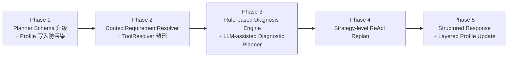
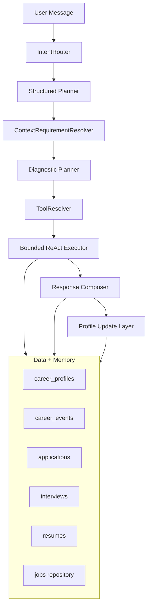
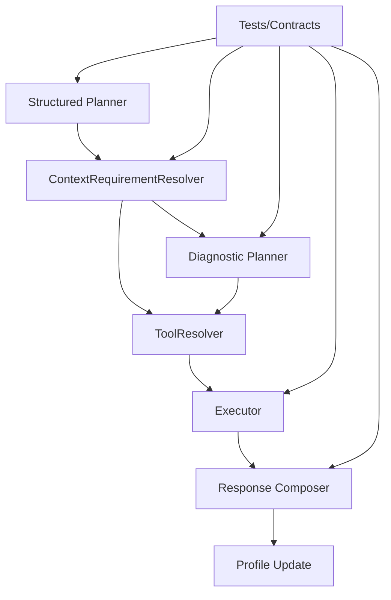

# Controlled Vertical Career Agent：分阶段实施计划图

> 硬约束：请不要推倒重构；所有新模块优先以兼容旧链路的 wrapper / resolver / validator 方式接入。

## 1) 路线总览（阶段图）

## 2) 目标架构（模块关系图）

## 3) 每阶段交付清单

### Phase 1 — Planner Schema 升级 + Profile 写入防污染（兼容旧字段）

**目标**：把 plan 从“steps 列表”升级为“任务语义对象”，并尽早控制 message-based profile 更新污染。

交付：

- `ChatPlan` 扩展字段：`domain/action/resources/confidence/goal/subgoals/plan_type/evidence_policy/stop_criteria`
- validator 增加 task/action 语义约束
- confidence 低阈值行为（追问或 fallback）
- `ProfileService.update_from_message` 增加主体识别/写入门控，避免“我朋友…”类输入污染当前用户画像
- 保留旧字段与 `chat.v1` 兼容

验收：

- 旧测试不破坏
- 新 schema 测试覆盖结构化字段
- “第三方主体表达不污染画像”测试通过

---

### Phase 2 — ContextRequirementResolver + ToolResolver

**目标**：把“缺什么上下文”“该调哪些工具”从 LLM 决策中解耦出来。

交付：

- `ContextRequirementResolver`：required/optional context 判定
- `ToolResolver`：`domain+action+resources -> tool_chain`
- 保留旧 `steps` 字段兼容，新增 `tool_chain` 由 `ToolResolver` 生成或校验
- 标准化追问输出
- resolver trace（reason 可观测）

验收：

- 缺 resume/job_detail/target_role 等场景行为一致
- LLM 不直接控制底层 tool 顺序
- 当 Planner `steps` 与 ToolResolver `tool_chain` 不一致时，以 ToolResolver 校验结果为准，并记录 `resolver_trace`

---

### Phase 3A — Rule-based Diagnosis Engine

**目标**：先落地可测试、可解释的规则诊断层，保证诊断可回归。

交付：

- `Career Diagnosis Engine` 输出：
  - `bottleneck_type`
    - 枚举：`resume_positioning / job_targeting / application_volume / interview_performance / skill_gap / insufficient_evidence`
  - `confidence`
  - `evidence[]`
  - `priority`
  - `recommended_actions[]`
- `insufficient_evidence` 分支

验收：

- “为什么投递没回音”可分流到不同瓶颈类型
- 结果可被 trace/sources 解释

---

### Phase 3B — LLM-assisted Diagnostic Planner

**目标**：在规则诊断稳定后，引入 LLM 辅助假设生成与证据收集策略，不替代规则底座。

交付：

- `Diagnostic Planner` 输出 hypotheses + evidence_to_collect
- 支持按 observation 动态切换诊断假设优先级
- 与 Rule-based Diagnosis Engine 结果对齐，不产生无证据结论

验收：

- LLM 诊断假设可被规则引擎消费并落地
- 回归测试可稳定复现关键诊断路径

---

### Phase 4 — Strategy-level ReAct Replan

**目标**：让 loop 从“换下一工具”升级到“改诊断策略”。

交付：

- executor 接入 `MAX_REPLANS` 真正计数
- 新动作：`switch_tool/replan_strategy/ask_for_context`
- replan reason 强制进入 `loop_trace`

验收：

- 无记录、有面试失败等 observation 会触发策略级改路
- 不会无限循环

---

### Phase 5 — Structured Response + Layered Profile Update

**目标**：产品化输出 + 可审计画像更新。

交付：

- `structured_report`：diagnosis/job_matches/skill_gaps/recommended_actions/learning_plan
- `structured_report` 不替代 `answer` 字段；`answer` 继续作为用户可读总结，`structured_report` 供前端卡片化展示
- Profile 更新三层：message-based、evidence-based、diagnosis-based
- profile update log（field/source/confidence/evidence/time）

验收：

- 前端可直接卡片化展示
- “朋友的目标”不污染用户画像

---

## 4) 关键依赖关系（模块级）

## 5) 风险与缓解

- 风险：一次性重构过大导致回归复杂
  - 缓解：按 Phase 分层引入，旧链路保留开关
- 风险：planner 字段变多导致模型不稳定
  - 缓解：先 optional + validator 渐进收紧
- 风险：诊断解释与真实证据脱节
  - 缓解：evidence 强绑定 sources，禁止无证据高置信结论
- 风险：新增模块导致核心链路过度重构
  - 缓解：新增模块优先以 wrapper / resolver / validator 方式接入，不直接推翻现有 AgentService / Router / observe loop

## 6) 项目展示价值（对外叙事）

- 不是“聊得像 agent”，而是“可控可评测的垂直决策系统”
- 亮点路径：
  1. structured planning
  2. context-aware execution
  3. diagnostic reasoning
  4. bounded replan
  5. structured action output

