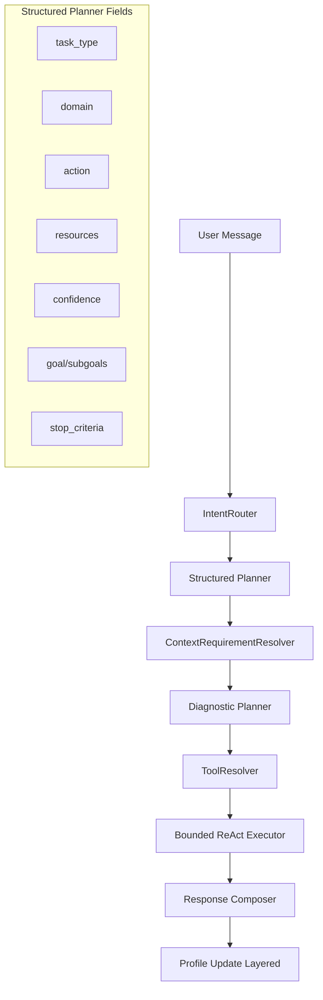

# Controlled Vertical Career Agent 改进方案与实施文档（PRD）

## 1. 项目定位

**北极星定位**：`Controlled Vertical Career Agent`（面向 Career Hub 求职场景的受控垂直 Agent）。

它不是：

- 普通 workflow（固定链路，不看 observation）
- 开放式 autonomous agent（无限工具探索、无业务边界）

它是：

- 在求职业务边界内，围绕「目标理解 → 证据收集 → 职业诊断 → 动态 replan → 结构化行动计划 → 画像更新」运行的产品级 Agent。

当前代码事实基础（已存在）：

- `AgentService.respond()` 主入口编排
- `IntentRouter` 高置信路由，`LLMClient.generate_plan()` 灰区 fallback
- `ChatPlan` + `ToolRegistry` + bounded observe loop
- 工具：`get_candidate_profile/get_resume_by_id/search_jobs/match_resume_to_jobs/get_applications/get_interview_feedback/get_career_insights`
- 记忆与画像：`update_from_message`、`refresh_from_career_records`
- 可观测：`plan/tool_trace/loop_trace/sources/llm_trace`
- 测试与 contract：router/planner/loop/missing_context/chat.v1

---

## 2. 当前问题分析（基于代码事实）

### 2.1 Planner schema 语义不足

- 当前 `ChatPlan` 主要字段：`task_type/reason/steps/needs_more_context/missing_context/follow_up_question/planner_source`。
- 缺：`domain/action/resources/confidence/goal/subgoals/plan_type/evidence_policy/stop_criteria`。
- 结果：规划层更像“步骤列表”，不足以承载诊断类任务的策略语义。

### 2.2 `career_insights` 更偏聚合摘要

- 当前 `CareerInsightService.get_career_insights()` 能输出 `strengths/risk_areas/next_actions`，但主要是规则聚合，不是 hypothesis-driven diagnosis。
- 缺少瓶颈类型、证据强度、优先级和可执行 success criteria 的结构化表达。

### 2.3 observe loop 动态性有限

- 当前 `_execute_react_loop` 支持 `tool/finish` 与 next_tool 切换，且有 no-progress/重复限制。
- 但策略级 replan（子目标改写、证据策略切换、追问策略切换）不强。
- `MAX_REPLANS` 常量存在，但未形成显式 replan budget 计数闭环。

### 2.4 缺上下文追问不统一

- 目前追问规则主要散落在 router/planner fallback（如缺 resume）。
- 缺统一 `ContextRequirementResolver`，导致 task/action 级上下文策略难复用、难审计。

### 2.5 工具决策边界不够清晰

- 现在 LLM 产出 `steps`，执行层再过滤。
- 目标应升级为：LLM 负责任务语义；`ToolResolver` 负责受控工具映射，避免 LLM 直接决定底层工具链。

### 2.6 输出产品化不足

- 当前输出主形态仍是自然语言 `answer` + `sources`。
- 缺统一结构化诊断报告对象，不利于前端做“诊断卡片/行动卡片/学习计划卡片”工作台。

---

## 3. 目标架构图




---

## 4. Structured Planner Schema 设计

## 4.1 向后兼容原则

- 保留现有 `ChatPlan` 字段，不破坏 `chat.v1` 合约和已有测试。
- 新字段追加为 optional（Phase 1），随后在特定 task/action 下逐步提升为 required（通过校验器控制）。

### 4.2 目标字段（新增）

- `domain: str`
- `action: str`
- `goal: str`
- `subgoals: list[str]`
- `resources: list[str]`
- `required_context: list[str]`
- `confidence: float`（0~1）
- `plan_type: Literal["direct","diagnostic","planning"]`
- `evidence_policy: Literal["use_existing","collect_more","ask_user"]`
- `stop_criteria: list[str]`

### 4.3 关键约束

- `confidence < threshold`（如 0.55）时，不盲目执行：进入追问或 fallback。
- `plan_type=diagnostic` 必须包含：`goal/subgoals/resources/stop_criteria`。
- `task_type=job_match` 且 `action in [match,compare,rank]`：资源要求必须覆盖 resume + job_detail/job_query。
- `task_type=learning_plan`：必须覆盖 `target_role/current_skills`（time_budget 可选但推荐）。

### 4.4 示例（目标态）

与用户给定 JSON 一致，此处不重复。

---

## 5. Task Taxonomy（统一任务族）

控制原则：不无限新增 `task_type`，采用 `task_type + action` 二维表达。

1. `conversation`
  - `greeting/help/fallback`
2. `resume_analysis`
  - `summarize/diagnose/improve/rewrite/extract_skills/extract_projects/tailor_to_role`
3. `job_search`
  - `search/filter/recommend/explain`
4. `job_match`
  - `match/compare/rank/explain_gap/recommend`
5. `career_diagnosis`
  - `diagnose_bottleneck/analyze_positioning/analyze_funnel/identify_gaps/prioritize_problems`
6. `career_planning`
  - `plan_next_steps/set_strategy/prioritize_targets/make_timeline`
7. `learning_plan`
  - `build_plan/schedule_weekly/recommend_projects/map_skills_to_jobs`

---

## 6. ContextRequirementResolver 设计

### 6.1 位置

`Structured Planner` 后、`ToolResolver` 前。

### 6.2 职责

- 根据 `task_type + action` 检查 required/optional context
- 决定：`ask_for_context` / `can_continue_with_assumptions` / `degrade_to_available_evidence`
- 产出标准化判定对象

### 6.3 输出 schema（建议）

```json
{
  "can_continue": true,
  "needs_more_context": false,
  "missing_context": [],
  "missing_optional_context": [],
  "assumptions": [],
  "follow_up_question": null,
  "decision_reason": "..."
}
```

### 6.4 规则样例（MVP）

- `resume_analysis.summarize` -> required: `resume`
- `resume_analysis.improve` -> required: `resume`; optional: `target_role`
- `job_match.match` -> required: `resume` + (`job_detail` OR `job_query`)
- `career_diagnosis.diagnose_bottleneck` -> required: `target_role` OR `candidate_profile`; optional: `resume/application_history/interview_feedback/target_jobs`
- `learning_plan.build_plan` -> required: `target_role/current_skills`; optional: `time_budget`

---

## 7. Diagnostic Planner 设计

### 7.1 适用范围

- `career_diagnosis`
- `career_planning`
- 复杂 `job_match`

### 7.2 输入

- planner schema + context resolver result + 当前 state 摘要

### 7.3 输出

- `diagnosis_goal`
- `hypotheses[]`
- `evidence_to_collect[]`
- `priority_hypotheses[]`

### 7.4 目标能力

- 从“直接回答”升级到“先建立诊断问题框架，再收证据，再下结论”。

---

## 8. Career Diagnosis Engine 升级

### 8.1 从聚合器升级为可解释诊断层

在现有 `CareerInsightService` 上分层：

1. Evidence Aggregator（已有能力增强）
2. Bottleneck Classifier（新增）
3. Recommendation Prioritizer（新增）

### 8.2 输出结构（建议）

```json
{
  "bottleneck_type": "resume_positioning",
  "diagnosis_summary": "...",
  "confidence": 0.82,
  "priority": "high",
  "evidence": [{"source":"resume","content":"...","strength":"medium"}],
  "recommended_actions": [{"action":"...","reason":"...","priority":"high","success_criteria":"..."}]
}
```

### 8.3 bottleneck_type 枚举

- `resume_positioning`
- `job_targeting`
- `application_volume`
- `interview_performance`
- `skill_gap`
- `insufficient_evidence`

### 8.4 规则框架（MVP）

- 无 application_history：不做 funnel 结论，转 `resume_positioning/target_role`。
- 投递多无面试：优先 `resume_positioning/job_targeting`。
- 有面试无 offer：优先 `interview_performance`。
- 目标不清：`insufficient_evidence` + 追问 `target_role`。
- 技能缺口明显：`skill_gap`。

---

## 9. ToolResolver 设计

### 9.1 核心原则

- LLM 不直接决定底层工具。
- LLM 输出 task 语义；`ToolResolver` 按 `domain/action/resources` 生成受控工具链。

### 9.2 输入

- structured plan
- context resolver result
- diagnostic plan（可选）

### 9.3 输出

```json
{
  "tool_chain": ["get_candidate_profile", "get_resume_by_id", "search_jobs"],
  "tool_payload_policies": {...},
  "resolver_reason": "..."
}
```

### 9.4 映射样例

- `resume_analysis.summarize` -> `get_latest_resume`(或 `get_resume_by_id`) + `generate_resume_summary`
- `job_match.match` -> `get_latest_resume` + `search_jobs/get_job_detail` + `match_resume_to_jobs`
- `career_diagnosis.diagnose_bottleneck` -> `get_candidate_profile/get_resume/get_applications/get_interview_feedback/search_jobs/get_career_insights`

---

## 10. Bounded ReAct Executor 升级

### 10.1 目标

从“next tool 选择”升级到“策略级 replan”。

### 10.2 新动作集合

- `continue`
- `finish`
- `switch_tool`
- `replan_strategy`
- `ask_for_context`

### 10.3 预算与护栏

- 沿用并强化：`MAX_LOOP_STEPS`、`MAX_STEP_REPEAT`
- 真正接入 `MAX_REPLANS`（显式计数）
- 每轮写入 `loop_trace`：`action/tool/purpose/observation/reason`
- 禁止缺证据硬结论

### 10.4 典型 replan

- application_history 为空 -> 从 funnel 诊断切到 resume/target 诊断
- 多轮面试失败 -> 焦点切换到 interview_performance

---

## 11. Response Composer 与结构化输出

### 11.1 目标

兼容当前 `answer/sources/trace`，新增结构化报告 payload，支持前端卡片化。

### 11.2 建议字段

- `diagnosis`
- `job_matches`
- `skill_gaps`
- `recommended_actions`
- `learning_plan`
- `profile_updates`
- `sources`
- `trace`

### 11.3 兼容策略

- 保留当前 `ChatResponse.answer/sources/tool_trace/loop_trace`。
- 新增可选 `structured_report`（Phase 5）避免一次性破坏接口。

---

## 12. Profile Update 分层策略

### A) Message-based lightweight update

- 仅当用户明确表达“自己的目标/技能/偏好”才写入。
- 引入“主体识别”与语义门控，避免“我朋友...”污染用户画像。

### B) Evidence-based refresh

- 从 applications/interviews/resume 结构化数据刷新：
  - `application_patterns`
  - `interview_weaknesses`
  - `resume_strengths`
  - `skill_keywords`

### C) Diagnosis-based update

- 从诊断结果沉淀：
  - `current_bottleneck`
  - `next_focus_areas`
  - `target_role_confidence`
  - `skill_gap_priority`
  - `recommended_strategy`

### 12.2 更新日志（建议）

新增 profile update log：`field/value/source/confidence/evidence/updated_at`。

---

## 13. JobRepository / Career Hub mock 数据方案

### 13.1 目标

- 岗位事实由 repository 提供，LLM 不编造事实。

### 13.2 jobs 结构（建议）

- `id`
- `title`
- `company`
- `location`
- `employment_type`
- `seniority`
- `description`
- `requirements`
- `skills`
- `source`
- `posted_at`

### 13.3 LLM 职责边界

- 可以：解释岗位、提取 gap、生成匹配理由/改进建议
- 不可以：虚构岗位事实/公司招聘信息/来源

---

## 14. 测试计划

新增/升级测试覆盖（与用户要求一致）：

1. resume summarize intent
2. resume diagnose intent
3. resume improve + target role
4. job_match with/without resume + job_query
5. 岗位适配问题缺 `job_detail` 追问
6. “为什么没回音”触发 diagnostic planner
7. application_history 空时的 replan
8. 投递多无面试 -> `resume_positioning/job_targeting`
9. 有面试无 offer -> `interview_performance`
10. 目标岗位缺失 -> `insufficient_evidence` 或追问
11. planner 低 confidence 行为
12. observe loop `MAX_REPLANS` + replan trace
13. diagnosis 输出结构校验
14. “我朋友想找…” 不污染画像

---

## 15. 分阶段实施路线（渐进，不推倒）

### Phase 1：Planner Schema 升级

- 扩展 `ChatPlan`（向后兼容）
- 升级 planner prompt 与 validator
- 加 confidence 低阈值策略
- 补 schema 合同测试

### Phase 2：ContextRequirementResolver + ToolResolver 雏形

- 上下文检查中心化
- domain/action 到 tool-chain 映射中心化
- 统一追问策略

### Phase 3：Diagnostic Planner + Diagnosis Engine

- hypothesis-driven 诊断
- 输出 `bottleneck/confidence/evidence/priority/actions`
- 改造 `get_career_insights`

### Phase 4：Strategy-level ReAct Replan

- 接入 `MAX_REPLANS`
- 支持 `replan_strategy/ask_for_context`
- observation 驱动路径切换

### Phase 5：Structured Response + 分层画像更新

- `structured_report` 输出
- 前端卡片化协议
- diagnosis-based profile update 与审计日志

---

## 16. 保持现状 vs 需要重构

### 16.1 保持现状（可复用资产）

- `AgentService.respond()` 主编排入口（保留）
- `IntentRouter` 高置信规则路由思想（保留）
- `ToolRegistry` + Pydantic 入参校验（保留）
- `RetrievalService` 混合检索与 reason 产出（保留）
- `chat.v1` contract 与 trace 可观测（保留）
- 现有测试资产与 eval harness（保留并扩展）

### 16.2 需要重构（分阶段替换）

- `ChatPlan` 由浅 schema 升级为 structured planner schema
- 在 Planner 与 Executor 中间引入 `ContextRequirementResolver` 与 `ToolResolver`
- `CareerInsightService` 从聚合摘要升级为诊断引擎
- `observe loop` 升级为策略级 replan（接入 `MAX_REPLANS`）
- `ProfileService` 更新策略升级为分层 + 审计

---

## 一句话结论

**最终北极星：Controlled Vertical Career Agent。**

不是普通 workflow，不是开放式 autonomous agent；
而是在求职业务边界内，用 `Structured Planner + Context Resolver + Diagnostic Planner + ToolResolver + Bounded ReAct`，输出可解释职业诊断与结构化行动计划的产品级 Agent。